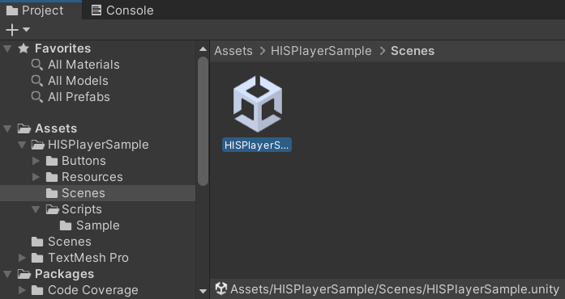
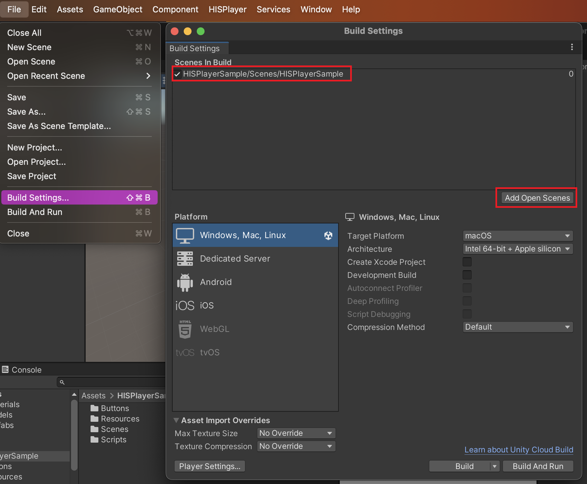
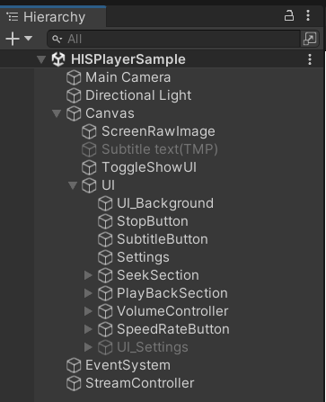
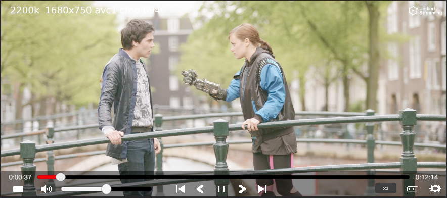

# Import HISPlayer Sample
Please, download the sample here -> [**HISPlayer MacOS Sample**](https://downloads.hisplayer.com/Unity/MacOS/HISPlayer_MacOS_Sample.unitypackage) (no need to download it if you have received it in the email).

Importing the package is the same as importing other normal packages in Unity. Select the downloaded package and import it.

- **Assets > Import Package > Custom Package > HISPlayer_MacOS_Sample.unitypackage**

- Complete the configuration for MacOS ->  [**Configure Unity for MacOS**](./setup-guide.md#12-configure-unity-for-macos)

- Open the scene **Assets/HISPlayerSample/Scenes/HISPlayerSample.unity**

- Import TextMesh Pro Essential

- Open **File** > **Build Settings** > **Add Open Scenes**

- Build and Run

To check how to set up the SDK and API usage, please refer to **Assets/HISPlayerSample/Scripts/HISPlayerSample.cs** and **StreamController GameObject** in the Editor.

## UI Demo
The UI components in the sample scene are fully modifiable. The sample is intended to show a comprehensive scene using the HISPlayer SDK to help demonstrate features such as play, pause, seek, etc.

